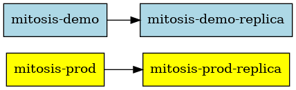
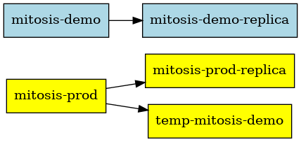
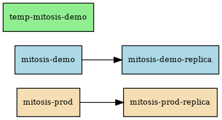
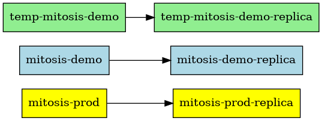
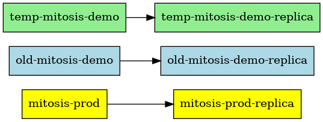
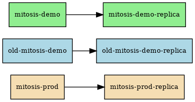
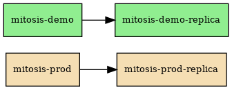

# stack-mitosis

[](https://circleci.com/gh/dgtized/stack-mitosis)

Clone and redeploy an AWS RDS instance to propagate a production dataset to
downstream environments like staging or demo. This allows staging to maintain
data parity with production in a throw-away environment.

## Process

Suppose for testing or sales purposes it is necessary to maintain an independent application stack with it's own database, which needs to periodically refresh data from the production database. To simplify the illustration, this will focus on the changes to the [AWS RDS](https://aws.amazon.com/rds/) database replication graphs, and omit the application and other services it may depend on. 

Consider two independent application stacks, production and demo, with primary databases `mitosis-prod` and `mitosis-demo` respectively. Each stack has a replication graph where a primary database is followed by one replica, ie `mitosis-prod` replicates to `mitosis-prod-replica` and `mitosis-demo` replicates to `mitosis-demo-replica`.



Stack mitosis will clone `mitosis-prod` into a new replica `temp-mitosis-demo`. The newly created replica will have the same data as `mitosis-prod`, but will copy instance attributes like tags, VPC security groups, and db parameter groups from the original `mitosis-demo`.



It then promotes `temp-mitosis-demo` to disconnect from the replication graph of `mitosis-prod`, and enables backups so it can act as a replication source.



Once `temp-mitosis-demo` is an independent replication graph, create a new replica of it called `temp-mitosis-demo-replica`, which will have identical data to `temp-mitosis-demo`, but instance attributes copied from `mitosis-demo-replica`.



It will then rename the existing `mitosis-demo` graph to prefix with `old-`.



Once that is complete, it's safe to rename the `temp-` prefixed clones back to `mitosis-demo` and `mitosis-staging-demo`.



 However, as this is a DNS swap, the application is likely still connected to the original `old-mitosis-demo`. By specifying a restart script, stack-mitosis can force the demo application to restart, and connect to the newly created `mitosis-demo` with fresh data from production. Once it has restarted the application successfully, it deletes the `old-` prefixed database instances from the original demo replication graph.



Note that this replication graph is a simple case, but it supports replacing arbitrarily complex replication graphs on RDS and has been verified with mysql and postgres database engines. The postgres engine on RDS only allows multiple replicas of a single primary, but the Mysql engine on RDS allows cascading replicas of replicas. See the AWS documentation for [working with RDS read replicas](https://docs.aws.amazon.com/AmazonRDS/latest/UserGuide/USER_ReadRepl.html) for more information on these limitations.

# Install

After installing a JDK, follow the [clojure install
instructions](https://clojure.org/guides/getting_started) for your environment
to ensure `clj` and `clojure` are in path.

# Credentials

Stack mitosis uses [aws-api](https://github.com/cognitect-labs/aws-api) to
interact with AWS. That uses the same [credentials
preferences](https://docs.aws.amazon.com/sdk-for-java/v1/developer-guide/credentials.html)
as the AWS Java client. However, stack-mitosis also supports using STS and
prompting for a MFA token to authorize use of a limited role for the duration of
the operation.

In order to support that the following environment variables need to be present;
`AWS_CONFIG_FILE`, `AWS_CREDENTIAL_PROFILES_FILE` should be set to specify any
credentials other than `.aws/credentials`. For the initial handshake with AWS,
credentials are needed from those files, or from environment variables,
`AWS_ACCESS_KEY_ID`, `AWS_SECRET_ACCESS_KEY`, and `AWS_REGION`. In order to
select an assumed role using an MFA token, for now a `role.edn` file should be
specified with the following values:

```
{:mfa-serial "arn:aws:iam::1234:mfa/username"
 :role-arn "arn:aws:iam::1234:role/sudo"
 :region "us-west-1"}
```

Hopefully in the future this can be parsed directly from the `AWS_CONFIG` file.

# Usage

    clj -m stack-mitosis.cli \
        --source mitosis-production --target mitosis-staging \
        --restart "./restart-service.sh"
        --credentials resources/role.edn
        [--plan]

## Flight Plan

The `--plan` flag will give a flight plan showing the expected list of API calls it's planning on executing against the Amazon API. 

```
$ clj -m stack-mitosis.cli --source mitosis-prod --target mitosis-demo --plan
Flight plan:
:CreateDBInstanceReadReplica   temp-mitosis-demo
        {:Port 5430, :DBInstanceClass "db.t3.micro", :Tags [{:Key "Service", :Value "Mitosis"}], :OptionGroupName "default:mysql-5-7", :SourceDBInstanceIdentifier "mitosis-prod", :StorageType "gp2", :MultiAZ false}
:PromoteReadReplica            temp-mitosis-demo
        {}
:ModifyDBInstance              temp-mitosis-demo
        {:ApplyImmediately true, :PreferredMaintenanceWindow "tue:07:02-tue:08:00", :PreferredBackupWindow "05:30-06:20", :DBParameterGroupName "default.mysql5.7", :BackupRetentionPeriod 1}
:CreateDBInstanceReadReplica   temp-mitosis-demo-replica
        {:Port 5431, :DBInstanceClass "db.t3.micro", :Tags [{:Key "Service", :Value "Mitosis"} {:Key "IsReplica", :Value "true"}], :OptionGroupName "default:mysql-5-7", :SourceDBInstanceIdentifier "temp-mitosis-demo", :StorageType "gp2", :MultiAZ false}
:ModifyDBInstance              temp-mitosis-demo-replica
        {:ApplyImmediately true, :PreferredMaintenanceWindow "mon:07:30-mon:08:00", :PreferredBackupWindow "06:40-07:10", :DBParameterGroupName "default.mysql5.7"}
:ModifyDBInstance              mitosis-demo-replica
        {:ApplyImmediately true, :NewDBInstanceIdentifier "old-mitosis-demo-replica"}
:ModifyDBInstance              mitosis-demo
        {:ApplyImmediately true, :NewDBInstanceIdentifier "old-mitosis-demo"}
:ModifyDBInstance              temp-mitosis-demo-replica
        {:ApplyImmediately true, :NewDBInstanceIdentifier "mitosis-demo-replica"}
:ModifyDBInstance              temp-mitosis-demo
        {:ApplyImmediately true, :NewDBInstanceIdentifier "mitosis-demo"}
:DeleteDBInstance              old-mitosis-demo-replica
        {:SkipFinalSnapshot true}
:DeleteDBInstance              old-mitosis-demo
        {:SkipFinalSnapshot true}
```

Note that for many cases, even if the clone process is interrupted, the flight plan will show steps it will try to execute again, and steps it will skip because it has detected that the instance has already been created or modified to the right attribute values. In other words, it tries to pickup where it left-off if there is a failure.

# Testing

    bin/kaocha # basic unit tests
    bin/kaocha --plugin cloverage # with coverage output

# License

Copyright © 2019-2021 Charles L.G. Comstock

Distributed under the BSD-3 Clause License (see LICENSE file)
